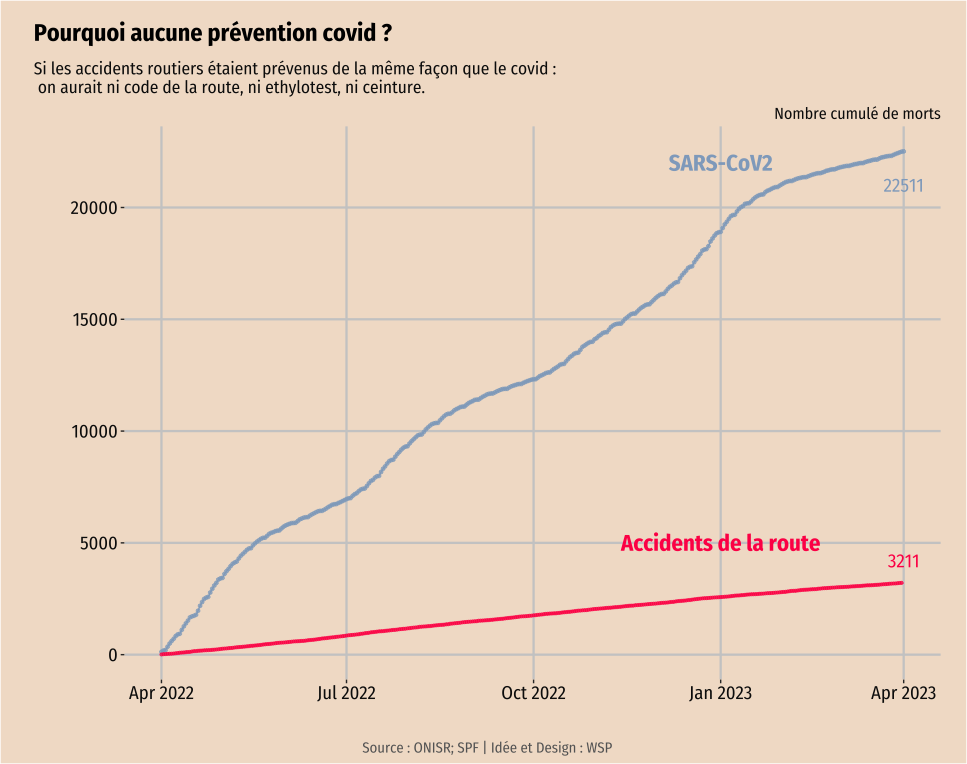

# COVID vs. Route
**Comparaison entre les morts des accidents de la route et les décès covid entre Avril 2022 et Avril 2023.**

Script R et données csv qui permettent de produire le graphique suivant :

Ce graphe n'est pas là pour banaliser les accidents de la route ou pour dire que leurs morts sont moins importantes. Mais pour mettre en perspective un manque de moyens et de volonté politique dans la prévention contre les maladies aéroportées et les morts qui en découlent. Et pour réaffirmer le caractère moretl du SRAS-CoV2, même en 2022-2023 et honorer aussi ces morts. 

Oui, le COVID existe encore, il tue et handicape toujours (Covid long).

Collaboration sur une idée de [Winslow Santé Publique](https://winslow.fr/).

**Source des données :**
- CepiDC (Inserm/SPF) [pour le COVID](https://www.cepidc.inserm.fr/)
- ONISR (Observatoire national interministériel de la sécurité routière) pour les [morts sur la route](https://www.onisr.securite-routiere.gouv.fr/outils-statistiques/recueil-de-donnees-annuelles) (⚠️ les données des accidents sont très descriptives)
